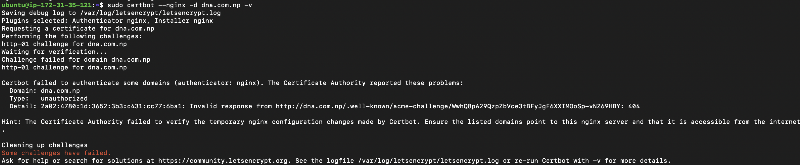

# Load_balancer_solution_with_Nginx_and_SSL-TLS

# Project Overview: Configuring NGINX as a Load Balancer with SSL/TLS

## Introduction

This project involves configuring **NGINX**, a high-performance web server and reverse proxy server, to function as a **load balancer**. The focus is to enable secure communication through **SSL/TLS** to ensure that the data transmitted between clients and servers is encrypted. Load balancing distributes incoming network traffic across multiple servers, improving the reliability and availability of applications.

## Objectives

- To configure NGINX to serve as a reverse proxy and load balancer.
- To enable SSL/TLS encryption for secure client-server communication.
- To understand how traffic management improves performance and fault tolerance.
- To gain hands-on experience with configuring NGINX settings for load balancing and security.

## Materials Required

- A server (or virtual machine) running a Linux distribution (e.g., Ubuntu, CentOS).
- NGINX installed on the server.
- At least two backend servers (can be local or virtual machines) to handle requests.
- Domain Name: A registered domain that users can access
- **Certbot** for generating SSL/TLS certificates (or a valid SSL certificate from a Certificate Authority).
- Basic knowledge of command-line interface and web server configurations.

## Targeted Architecture


## Part 1: Configure NGINX as a Load Balancer

### Step 1: Set Up Your NGINX Server

#### 1. Provision an NGINX Server

-  First, created an ec2 instance named it as "nginx_lb" in a region "Mumbai" with instance type "t2.small", AMI (Amazon Machine Image ) as "ubuntu 24.04", created security group having inbound rules for SSH,Http and Https ie port 22,80 and 443 to allow traffic.
- Private key was generated and named it as : "project_private_key" and downloaded ".pem" file.
- Used the same private key previously downloaded to connect to EC2 instace via ssh as in previous projects.


- Update /etc/hosts file for local DNS with Web Servers’ names (e.g. Web1 and Web2) and their local IP addresses:
```
sudo vi /etc/hosts
```
- Add the following line:
```
172.31.41.29 web1 #web1_ip_adderres dnsname
172.31.37.30 web2 #web2_ip_address web2 
```

#### 2. Install NGINX

```
sudo apt update
sudo apt install nginx
```


### 3. Configure NGINX for Load Balancing

- Open the NGINX configuration file (/etc/nginx/nginx.conf).
- Edit the file to include an upstream block for your backend servers:
```
upstream myproject {
        server 172.31.41.29 weight=5; #webserver1_ip_address
        server 172.31.37.30 weight=5; #webserver2_ip_address
     }
     server {
        listen 80;
        server_name dna.com.np www.dna.com.np;
         location /.well-known/acme-challenge/ {
           root /var/www/html;
         }
        location / {
        proxy_pass http://myproject;
        }
     }
    include /etc/nginx/conf.d/*.conf;
    # include /etc/nginx/sites-enabled/*;
```

### 4. Restart NGINX
```
sudo systemctl restart nginx
```
### 5. Verify NGINX Installation
```
sudo systemctl status nginx
```

3. Configure Elastic IP address for the load balancer. : This is done because , everytime we stop the ec2 instance, the public ip address changes, therefore if attached to a dns record, that would mean that everytime we stop and restart the ec2 instance, and the ip address changes, we will need to go back and point the domain to the new ip address, this is really stressful. To avoid this, we have to use a service by aws called 'ELASTIC IP', Elastic ip is a specialized public Ip address that can be assigned to an instance and that never changes no matter how many times the instance is restarted, it remains the same. in order to do this ,follow the steps below

- On your AWS console search bar, type and search for 'Elastic IP'.
- Click on allocate IP and always confirm it is in the same availability zone as your intance.
- After creating the elastic Ip, click on the check box for the IP and under actions, select associate elastic IP address
Associate it with your load balancer instance.


### Step 2: Test the Load Balancer

- Ensure that the load balancer is successfully passing requests to your backend servers.
- You can perform simple tests using tools like curl or by accessing the domain name in a web browser.


## Part 2: Register a Domain Name & Configure SSL/TLS

### Step 1: Register a Domain Name

### 1. Choose a Domain Registrar

Register your domain through a provider like GoDaddy, Namecheap,Hostinger or others.

### 2. Configure DNS Settings

- Go to your domain registrar's DNS settings and create an A record pointing to the public IP address of your NGINX server.

- Visit a website like 'https://dnschecker.org/' and confirm if indeed the domain name is already pointing to the ip address via the a records.


## Step 2: Obtain and Configure SSL/TLS Certificates

### 1. Install Certbot

- Ensure your system has the snapd service running.
```
sudo systemctl status snapd
```

- Install Certbot using the following commands:
```
sudo snap install --classic certbot
```
```
sudo ln -s /snap/bin/certbot /usr/bin/certbot

```

### 2. Set Up SSL Certificates

- Request a certificate for your domain:
```
sudo certbot --nginx -d yourdomain.com 
```
Follow the interactive prompts to complete the certificate issuance.
If you get error:

- Check for duplicate server:
```
grep -R "server_name" /etc/nginx/
```
- Also, you can use:
```
grep -R "server_name" /etc/nginx/ | awk '{print $2}' | sort | uniq -d
```


- Check for CAA record for your Domain name , if many are present reduce into few number, especially remove issuewild.
```
dig dna.com.np CAA
``` 

In my case, there were many CAA presents and error has been resolved by removing few of them.
After resolving it, get the certification :


### 3. Automatic Renewal

- Certbot automatically sets a cron job for certificate renewal, but you can verify it:
```
sudo certbot renew --dry-run
```

- Setting up a cron job to automate checking the server for ssl and renewal constantly

- edit the cron tab
```
    crontab -e
```
- Add the following line
```
    * */12 * * *   root /usr/bin/certbot renew > /dev/null 2>&1
```


- Save changes and exit


### Step 3: Verify Your SSL Configuration

- Visit your domain (both http://yourdomain.com and https://yourdomain.com) to confirm that the SSL certificate is correctly installed.
- http://dna.com.np

- https://dna.com.np


## Conclusion

You have successfully configured NGINX as a load balancer for your backend servers and secured your domain with SSL/TLS. This architecture ensures reliable distribution of traffic while maintaining secure connections for users. Monitor your setup regularly to ensure optimal performance and security.
